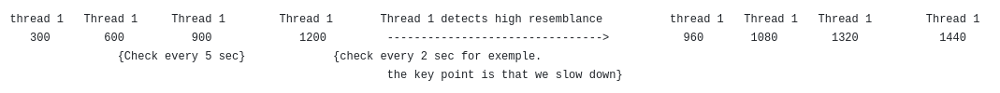

# ImageSearch_in_Video
This Python program scans a video to find an image within it that matches an image the user is looking for. To do this, you can either import your own images or perform an image search using the Google API. If you choose the latter, you will need to configure the number of retrieved images, the search query, and provide your own API key and search engine ID.

Regarding how the program works, it processes the video and extracts an image every X frames. This image is then compared to the images provided by the user using an AI model. If the similarity threshold is met, the timestamp is recorded. Both the similarity threshold and the analysis frequency are configurable. At the end, all timestamps that exceeded the similarity threshold are displayed along with their corresponding similarity scores.

I have implemented a second method, which is a bit less "brute-force" and which I have called the "car queue" method, following this principle:

This method assumes that as we get closer to a sequence in the video where the searched element appears, the similarity coefficient will increase. For example, if I am looking for an aquatic sequence in my video and my reference images contain a lot of blue shades, the similarity scores will increase as I approach that sequence. Arbitrary thresholds are applied, and testing is required to find the optimal "sweet spot." The program includes a configuration that worked well for me, but better settings might be found.

For instance, if the detected similarity coefficient is 50%, the frame_gap is set to 10 seconds instead of 5 seconds because we are likely far from the desired sequence. Conversely, if the similarity coefficient reaches 80%, we reduce the frame_gap from 5 seconds to 2 seconds. Here is a small illustration:

Finally, to ensure that nothing is missed in case we "braked" too quickly, we slightly go back using the new frame_gap.

In this example, we check all frames between the trigger frame and the previous one using the new interval (here, 2). This means we will verify 2 frames backward before continuing. However, note that the checked backward frames do not affect the speed of the queue.

This approach ensures that we don't skip the desired segment while keeping computational cost low. We only add 1 to 2 extra frames to check. The key is to find a good configuration to avoid braking too hard.

Here is a benchmark example using a 1h54 video on my laptop with a Ryzen 5600 processor with integrated GPU, showcasing the performance differences:

Test 1 : 2min48sec  check every 5 secondes for the video "Ratchet_et_clank_2_part_7_CRF.mp4" that last 1h54
matchin_images_treshold = 88 | num_requests = 2 | filtering_treshold = 0.80 | frame_gap = 300 | fonction utilisé : V2 avec gpu | batche_size=1
6 images + extracted frame

Résults : image found at timestamps: {10.416666666666666: 88.75721096992493, 10.5: 89.77494239807129, 10.583333333333334: 90.58698415756226, 56.5: 92.62803792953491}

=====================================================================================================

After implementation of adaptative speed

Test 2 : 1min08sec  seuil={75:20,80:10,85:5,90:2,100:2}  pour la vidéo "Ratchet_et_clank_2_part_7_CRF.mp4" de 1h54
matchin_images_treshold = 88 | num_requests = 2 | filtering_treshold = 0.80 | fonction utilisé : V2 avec gpu | batche_size=1 
6 image de reference + extracted frame

Résults : image found at timestamps: {10.583333333333334: 90.63405990600586}

======================================================================================================

After implementation of chekcing frame befor the trigger frame when slowing down

Test 3 : 1min27sec  seuil={75:20,80:10,85:5,90:2,100:2}  pour la vidéo "Ratchet_et_clank_2_part_7_CRF.mp4" de 1h54
matchin_images_treshold = 88 | num_requests = 2 | filtering_treshold = 0.80 | fonction utilisé : V2 avec gpu | batche_size=1 | programme_recherche_intelligent
6 image de reference + extracted frame

Résults : image found at timestamps: {10.5: 89.82644081115723, 10.383333333333333: 89.16247487068176, 10.433333333333334: 88.39675188064575, 10.55: 88.79101276397705, 10.583333333333334: 90.63405990600586}

/*===================================================================================================*/

We clearly see that the "car queue" method is faster and more reliable than the brute force methode. Here is an exemple of how the distribution of images work in my testings :

Pour la recherche Ratchet and Clank ps2 hydropack sur la vidéo Ratchet_et_clank_2_part_7_CRF.mp4 avec 5 sec de frame gap:

- 0.0'%' d'image entre 0'%' et 20'%' de similarité
- 0.0'%' d'image entre 20'%' et 40'%' de similarité
- 0.07309941520467836'%' d'image entre 40'%' et 60'%' de similarité
- 31.432748538011694'%' d'image entre 60'%' et 80'%' de similarité
- 68.42105263157895'%' d'image entre 80'%' et 100'%' de similarité
- 168 accélérations
- 170 décélération
time : 168 sec

I have a testing file that produces this output. You can try it to find the best configuration.

That's pretty much everything for this program. It is always possible to modify certain elements to make it more efficient, such as changing the model or adjusting the batch_size based on your GPU's power.

Note that I developed this program on an AMD GPU. you may need to tweak a few things to make it work on an Nvidia gpu. I have a colab file in the repo that uses nvidia gpu if you wanna try it.

# Installation

Locally : 

I recommend using conda :
conda create -n myenv python=3.10
-pip install sentence-transformers
-installer requests
-installer opencv-python
-pip install torch-directml

You will not need torch-directml on nvidia GPU

Google collab :

You can use it on collab even though it may take some time to import your video file especially if they are heavy. I have a notebook file on this repo you can use.

